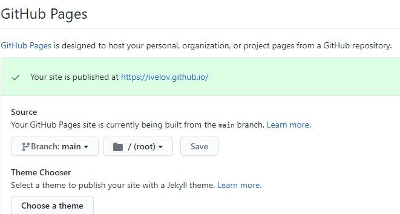
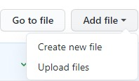

<h1 align="center">Відповіді на контрольні питання</h1>
<h2>1. Як налаштувати репозиторій, щоб він мав вигляд як сайт у мережі Інтернет?</h2>

На сторінці налаштувань потрібно обрати GitHub Pages->Source та зі списку, що випадає, вибрати гілку main, натиснути на кнопку Save   

<h2>2. Як завантажити файли до репозиторію?</h2>

На головній сторінці репозиторію потрібно натиснути ***add files*** та зі списку, що випадає, вибрати ***upload files***, обрати необхідні файли та натиснути ***commit changes***

